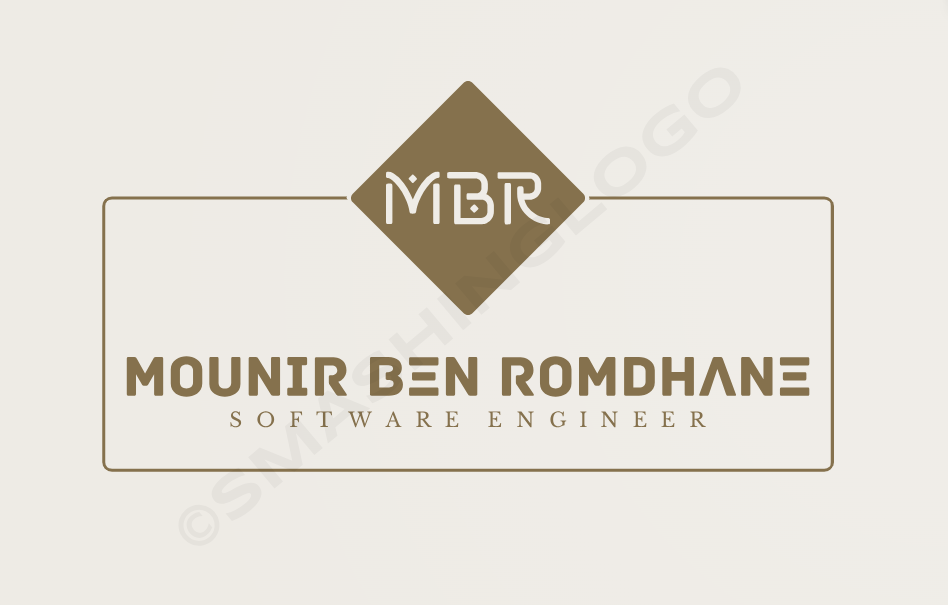

	
<h1 align="center"><b>Hi 👋, I'm Mounir Ben Romdhane </b></h1>
<h3 align="center">A passionate Programmer from Tunisia</h3>

 I'm a Young Software Engineer Student at Esprit University, Self-Finder and Instructor from Tunis, Tunisia . 

  

- 🔭 &nbsp; I’m currently working on understanding myself...
<!-- - 🎙️ &nbsp; Host the [PRODCAST-NAME]() podcast. -->
- 🌱 &nbsp; I’m currently learning everything ...
<!-- - 👨🏻‍🎓 &nbsp; I graduated with a Bachelor's degree in Computer Science from [ISAMM](http://www.isa2m.rnu.tn/). -->
- 🎓 &nbsp; I’m currently studying Engineer's degree Software Engineering [@ESPRIT University](https://esprit.tn/).
- 👯 &nbsp; I’m looking to collaborate with on performance-related projects.
<!-- - 🤔 &nbsp; I’m looking for help with ... -->
- 👨🏻‍💻 &nbsp; Most of my projects are available on [Github](https://github.com/Chadi7781).
- 🤝 &nbsp; Welcom for everyone who need help or collaborator.
- 🥅 &nbsp; 2023 Goals: *********.
- 💬 &nbsp; Ask me about anything (within reason) [here](https://github.com/Mounir-Ben-Romdhane/ama)! I will be happy to help.
- 📫 &nbsp; How to reach me: &nbsp;
- 😄 &nbsp; Pronouns: ... He/Him/His
- 👾 &nbsp; Fun fact: ... “A quitter never wins and a winner never quits.”

 

	
  
<b>📈 Github Stats</b>

  
 
    
	

<h3 align="center">Languages and Frameworks</h3>
 

&nbsp;***My working tools...***

  
  
  
  
  
  
  
  
  
  
  
  
 
  
  
  
 
  
  
  
 
  
  
 
  

&nbsp;***Connect with me...***

  
 

 
<h3 align="left">Achievements:</h3>

  

 <em><b>I love connecting with different people</b> so if you want to say <b>hi, I'll be happy to meet you more!</b> :)</em>

 

 Created with 🧡 by <a href="https://www.linkedin.com/in/mounir-ben-romdhane/">Mounir Ben Romdhane</a>

